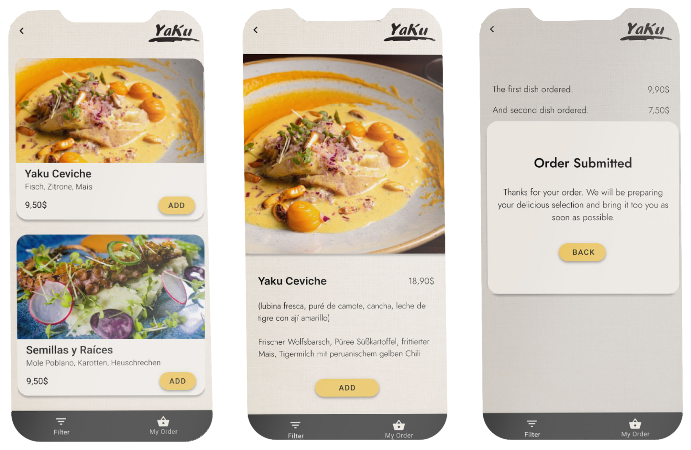
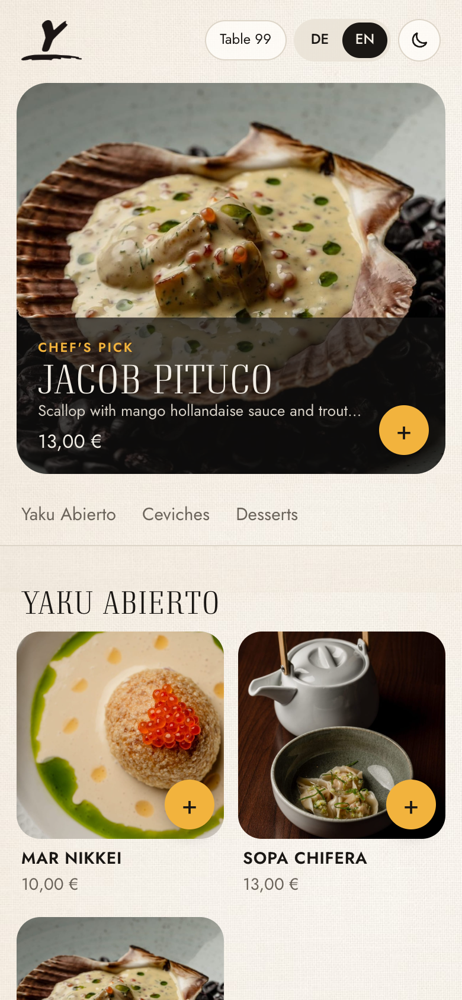
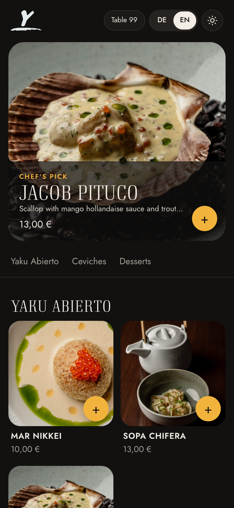
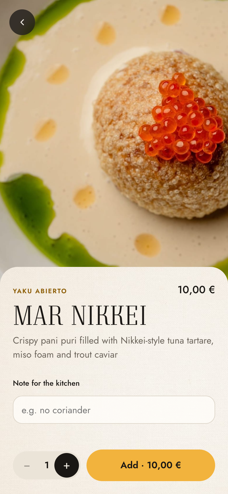
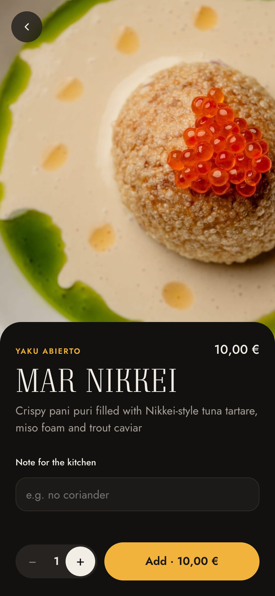
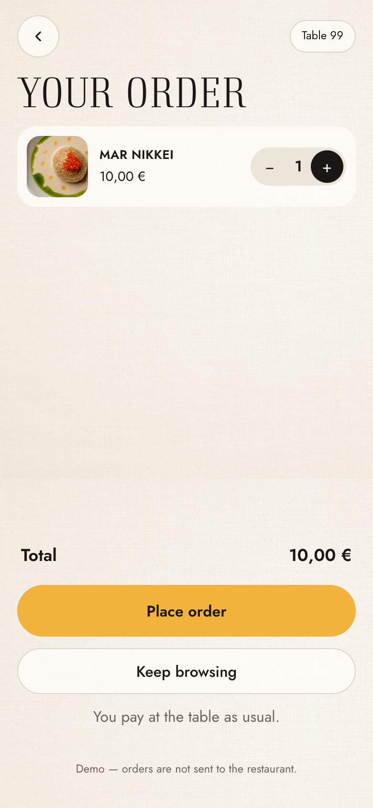
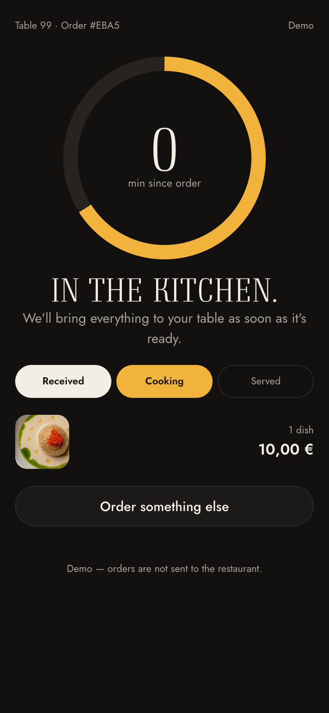
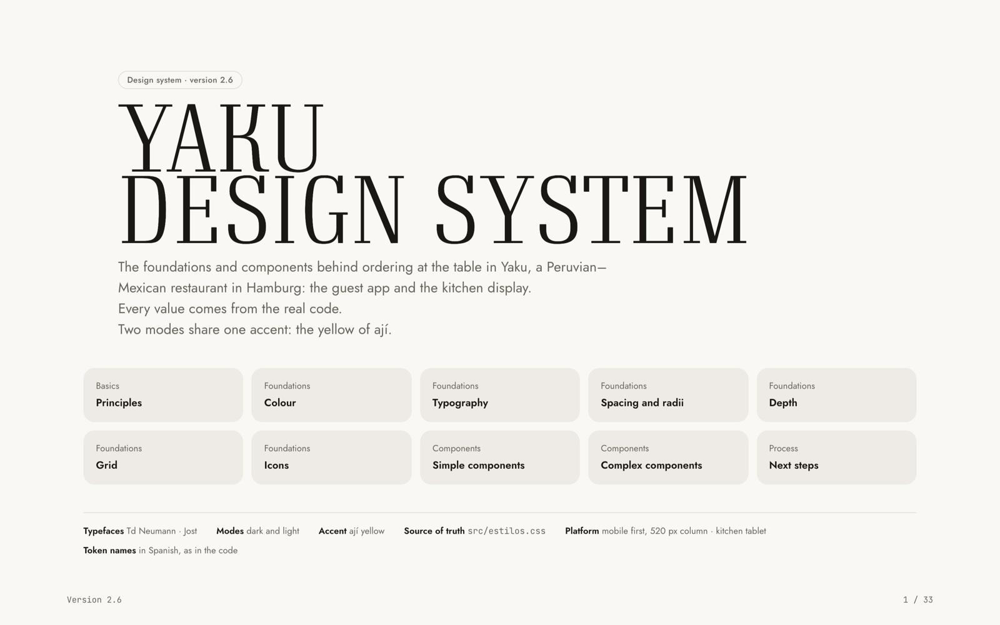
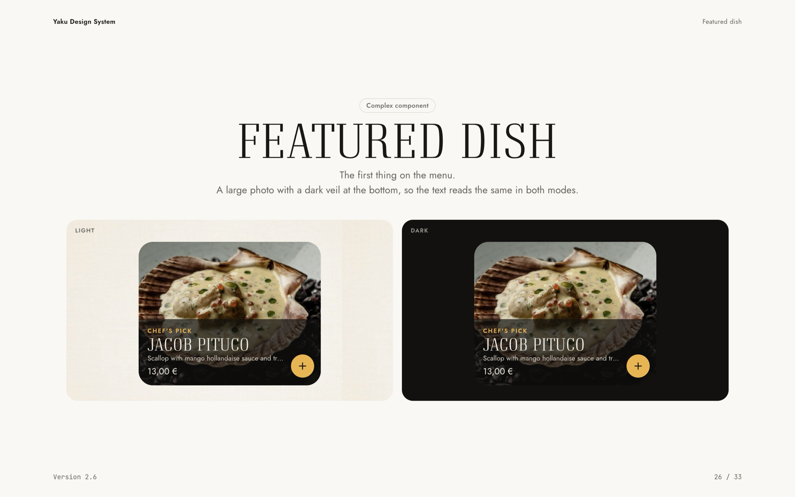

## The brief

Yaku already had a strong brand and a great kitchen. Years ago I designed a *Mobile Ordering Prototype* for them — but it was only visuals. This time the goal was a **working product** the owners can test with real guests, without changing the way they get paid: guests order from the table, and pay the waiter as usual.

## Where it started

*Before the app: the original Mobile Ordering Prototype — still only visuals.*

*The restaurant's responsive website — part of the brand experience I designed for Yaku.*

[Explore Yaku's website ↗](https://www.yaku-restaurante.de)

## What I built

- **Guest app** — scan the QR code on the table, browse a photo menu, open a dish, add a note for the kitchen, send the order and follow its status live. German and English, light and dark.
- **Kitchen screen** — a tablet view where new orders arrive with a sound. One tap moves an order from *new* to *cooking* to *served*, and the guest's phone updates on its own. Dishes can be marked as sold out.
- **QR system** — every table has its own secret code, printed on a card. Without it, nobody can place an order.

 
*The menu in both modes: the light one uses the canvas texture of Yaku's own website, the dark one a warm black that lets the food photography glow.*

 
*Every dish opens full-screen — the photo does the selling. Guests can leave a note for the kitchen.*

 
*Review the order, send it, and watch the status move as the kitchen works.*

## Design decisions

- **Photography first.** The prototype only lists dishes that have a photo, and opens with a *Chef's pick*. A menu is a sales tool.
- **Two moods, one brand.** Dark mode uses a warm black (`#121110`) instead of pure black, so it sits well with the dark wood in the food photos. Light mode uses the restaurant's own canvas texture. The accent is *ají amarillo* — the Peruvian yellow chili in their dishes.
- **Brand details.** Yaku's display typeface, and their hand-drawn "Y" as the app icon.
- **A kitchen screen for busy hands.** High contrast, large buttons, the table number big enough to read from across the pass, and guest notes highlighted so nobody misses *"no coriander"*.

## The design system

Two modes share one set of variables: a warm black where the food glows, and the canvas texture of Yaku's website. Ají yellow is the only accent, and it always means the next step. I documented the system as a 33-page specimen book: principles, colour with every contrast checked in both modes, the two typefaces, spacing, depth, grid, icons, and each component side by side in light and dark — from the dish card to the kitchen ticket.

 
*The cover, and the featured dish in light and dark.*

[View the design system (PDF, 33 pages) ↗](/pdf/yaku-design-system.pdf)

## Architecture

- **Front-end:** React + Vite, one app for guests (`/`) and kitchen (`/cocina`).
- **Back-end:** Supabase, self-hosted on my own Hetzner server in Nuremberg — Postgres, Realtime and Auth — behind Caddy with automatic HTTPS.
- **Real time:** the kitchen subscribes to order changes and receives them instantly; the guest's status refreshes every few seconds.
- **Security by default:** row-level security on every table. Guests can only create an order through a database function that checks the table's secret code and limits how many orders a table can send in a few minutes. The kitchen uses its own role — it can see and move orders, but it is not an admin. I verified the rules with automated checks acting as an anonymous visitor.

## Privacy (DSGVO)

Guests don't create accounts and no personal data is collected — just a table and some dishes. Everything runs on a server in Germany, and demo orders delete themselves every night.

## Status

**Live prototype**, currently being tested by the owners. Next steps: allergen information for all dishes (required by EU law), a menu the restaurant can edit itself, and a connection to their till.
