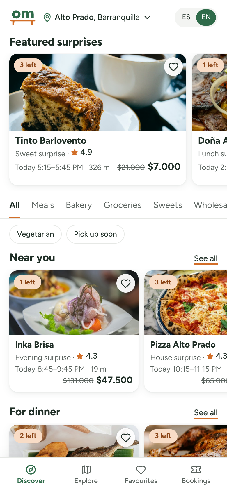
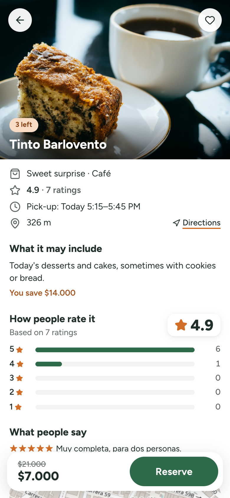
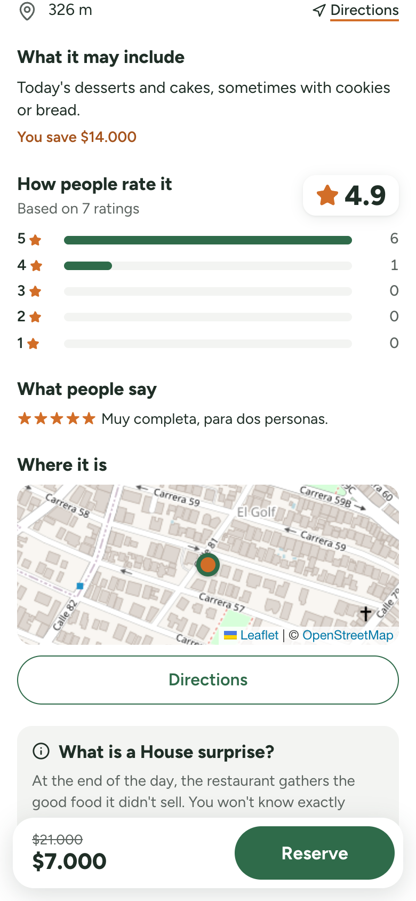
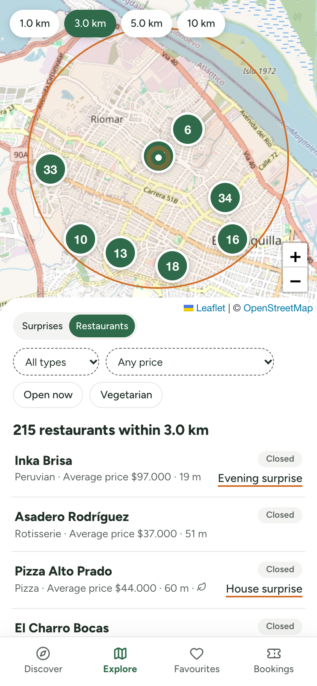
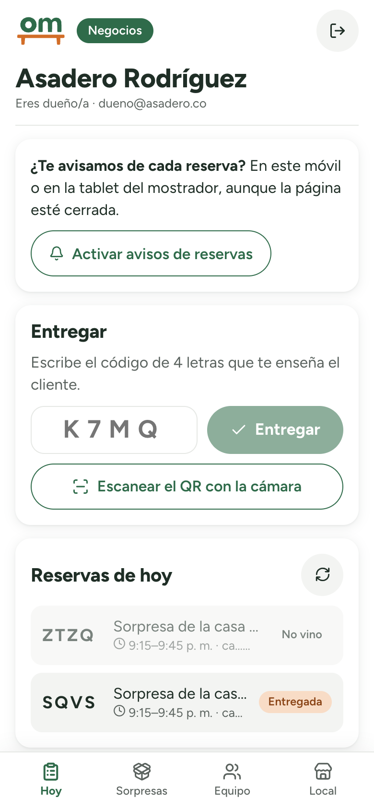
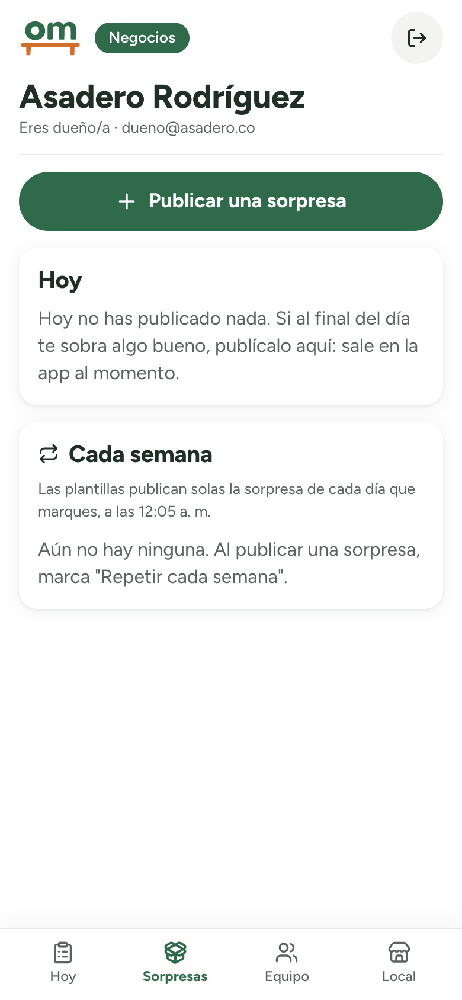
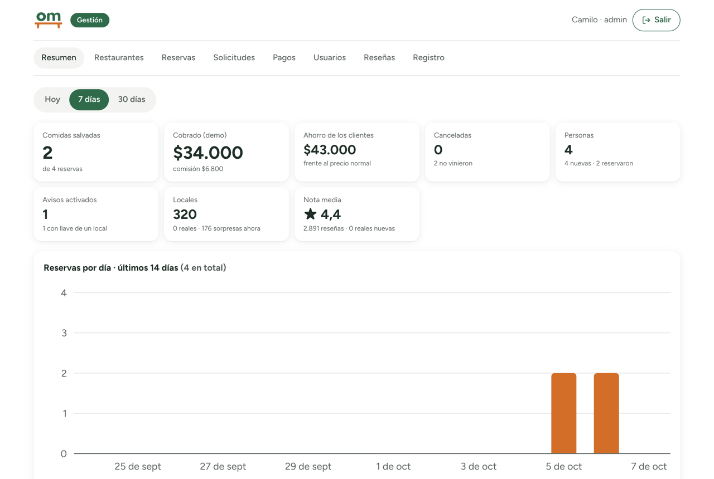
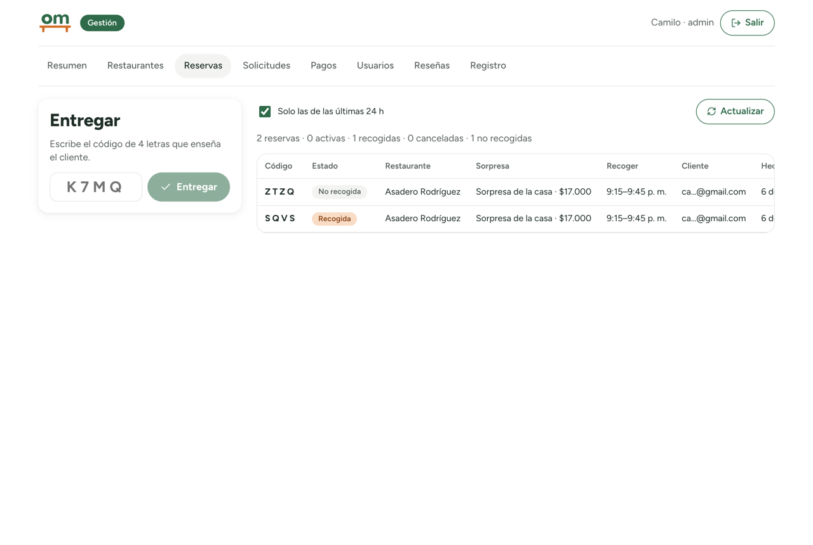

Ich habe die Marke und das Produkt gestaltet und drei Apps auf einer API gebaut: die App für die Kundschaft, ein Portal für die Betriebe und ein Büro für die Verwaltung. Alles funktioniert wirklich — Konten, Reservierungen, Abholcodes, Bewertungen, Benachrichtigungen — nur das Geld nicht: Zahlungen werden mit Testkarten simuliert.

 
*Restaurants bieten gutes Essen, das sie nicht verkauft haben, als „Überraschung des Hauses“ an — für etwa ein Drittel des Preises. Man reserviert, bezahlt und holt noch am selben Tag ab.*

## Weniger Verschwendung, ein vollerer Tisch

Jeden Abend wird gutes Essen aus nur einem Grund weggeworfen: Der Tag ist vorbei. Otra Mesa gibt ihm einen zweiten Tisch — für etwa ein Drittel des Preises für Menschen in der Nähe und mit einem fairen Ertrag für das Restaurant statt eines Verlusts.

### Weniger Verschwendung
Essen, das noch gut ist, wird gegessen statt entsorgt.

### Eine stärkere lokale Wirtschaft
Restaurants holen einen Teil ihrer Kosten zurück und lernen neue Nachbarn kennen; Menschen entdecken Orte, die sie sonst nie ausprobiert hätten.

### Restaurants, die Gutes tun
Essen zu retten ist eine sichtbare, großzügige Geste — ein Grund mitzumachen, der über die Zahlen hinausgeht.

Ein funktionierendes Produkt mit erfundenen Restaurants und Großhändlern in Barranquilla, Kolumbien.

## Eine ruhige, klare Oberfläche

Die zweite Version ist bewusst leise: weißer Hintergrund, Text in einer einzigen Farbe, eine Schrift, das Grün des Logos für die wichtigsten Buttons und das Terrakotta nur für kleine Details — Sterne, Unterstreichungen, Etiketten. Zuerst kommen die empfohlenen Überraschungen in etwas größeren Karten zum Wischen; darunter kleinere Reihen: in der Nähe, bald abholen, fürs Abendessen. In einer Überraschung führt das Foto, die Details folgen in kurzen Zeilen — und man sieht, wie andere sie bewerten, Stern für Stern. Uhrzeiten stehen so da, wie man sie in Barranquilla sagt: 5:15–5:45 p. m.

 
*Bewerten kann nur, wer seine Überraschung wirklich abgeholt hat. Die Karte zeigt alle Restaurants — oder nur die, die gerade geöffnet haben, in der Zeit von Barranquilla.*

## Drei Apps, eine API

### Für die Kundschaft
Entdecken und Karte, reservieren und bezahlen, ein QR-Code zur Abholung, Favoriten im Konto, eine Bewertung nach jeder Abholung und eine laufende Zählung des geretteten Essens.

### Für die Betriebe
Aufnahme beantragen und freigeschaltet werden; die Überraschungen des Tages oder wöchentliche Vorlagen veröffentlichen, die sich selbst einstellen (immer mindestens 30 % günstiger); den QR-Code der Kundschaft mit der Handykamera scannen; das Team einladen; das Geld sehen; die Bewertungen lesen — und bei jeder neuen Reservierung eine Benachrichtigung erhalten.

### Für die Verwaltung
Eine Übersicht mit einem 14-Tage-Diagramm, Anfragen zum Freigeben oder Ablehnen, Restaurants, Reservierungen, Zahlungen und Auszahlungen, Konten, Bewertungen und ein Protokoll jeder wichtigen Aktion.

 
*Das Portal für Betriebe lebt auf dem Handy an der Theke. Es spricht Spanisch: Es ist für die Restaurants von Barranquilla gemacht.*

 
*Das Büro der Verwaltung: was gerettet und kassiert wurde, und jede Reservierung, sobald sie ankommt.*

## Was ich gebaut habe

### Die Küche hinter den Kulissen
Eine Node.js-API vor zwei Datenbanken: Postgres als offizielles Archiv, MongoDB als Kompass für „in der Nähe“.

### In der Nähe — auf den Meter genau
Ein 2dsphere-Index und `$geoNear` finden, was im Umkreis von 300 m, 1 km oder 10 km liegt — geprüft mit der Haversine-Formel.

### Reservierungen ohne Überbuchung
Der Bestand sinkt in einem einzigen Datenbankschritt: Ist nur noch eine Überraschung da und tippen zwei gleichzeitig, bekommt sie nur eine Person.

### Zahlungen, von Anfang bis Ende simuliert
Autorisiert beim Reservieren, belastet bei der Abholung, storniert beim Absagen, von der Verwaltung erstattbar — mit 20 % Provision und Auszahlungen pro Restaurant. Es werden nur Testkarten angenommen, und gespeichert werden immer nur die letzten vier Ziffern.

### Anmelden mit Google oder einem E-Mail-Code
OpenID Connect mit PKCE oder sechsstellige Codes, von Grund auf gebaut: gespeichert werden nur Fingerabdrücke, Codes laufen ab und verfallen nach fünf Versuchen.

### Ein Konto, mehrere Schlüssel
Eine Person kann ein Restaurant besitzen und in einem anderen arbeiten. Einladungen per E-Mail werden bei der ersten Anmeldung zu Schlüsseln, und ein Restaurant kann seine letzte Inhaberin nie verlieren.

### Benachrichtigungen
Web Push mit Schlüsseln, die auf dem Server erzeugt wurden: eine neue Reservierung für das Team, „deine Abholung beginnt in 30 Minuten“ für die Kundschaft und ein Hinweis, wenn ein Favorit etwas veröffentlicht.

## Gebaut, um zu vertrauen

Nächtliche Backups, die per Wiederherstellung getestet sind, jede Datenbankänderung vorher an einer Kopie geprobt, Ratenbegrenzung, automatisches Löschen nach 30 Tagen, zwei Wächter, eine installierbare App mit Offline-Bildschirm und eine Datenschutzerklärung, die jeden Datenfluss abdeckt (DSGVO). Nach jeder Änderung gehen zwei Roboter den ganzen Weg: 16 Prüfungen für die Kundschaft, 59 für Betriebe und Verwaltung.

## Stack

### Front-end
React · React Router · Vite · Leaflet + OpenStreetMap

### Back-end
Node.js · Express · Postgres · MongoDB · Web Push · Google OpenID Connect

### Infrastruktur
Hetzner Deutschland · Docker · Caddy · Monorepo
