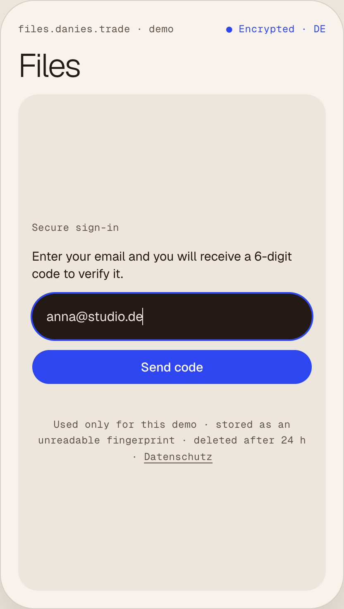
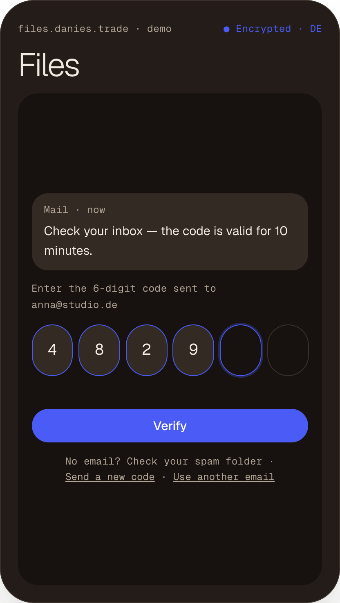
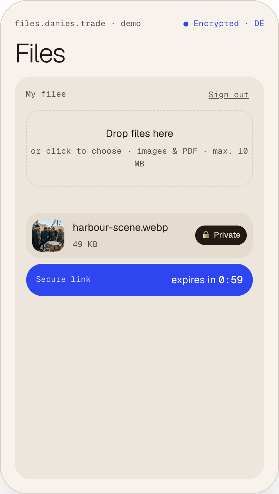
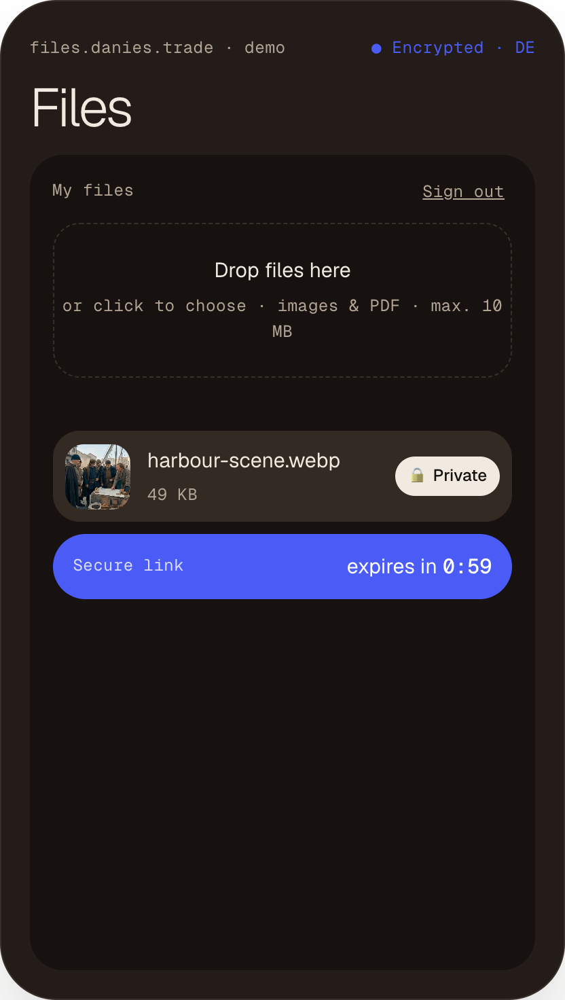

Diseñé y desarrollé el sistema completo — autenticación, permisos, almacenamiento privado y despliegue.

 
*El acceso empieza con un email verificado: un código de un solo uso, válido durante unos minutos y una sola vez.*

## Seguridad desde el diseño

El acceso se verifica con códigos de un solo uso enviados por email.\
Los datos están protegidos en la propia base de datos con seguridad a nivel de fila (RLS).\
Los archivos siguen siendo privados y se pueden compartir con enlaces firmados que caducan.

## Qué construí

### Acceso verificado
Entrada sin contraseña.

### Datos privados
Los datos de cada usuario, aislados por reglas de la base de datos.

### Archivos protegidos
Subidas privadas con enlaces para compartir que caducan.

### Roles y permisos
El acceso se controla en el servidor.

 
*Cada archivo es privado por defecto. Al compartirlo se crea un enlace seguro que caduca solo.*

## Construido como base

Pensado como una base reutilizable para portales de clientes, herramientas internas y productos que manejan datos privados de usuarios o documentos.

## Stack

### Front-end
React · Vite

### Back-end
Supabase · Postgres · Auth · Storage

### Infraestructura
Hetzner Alemania · Caddy
