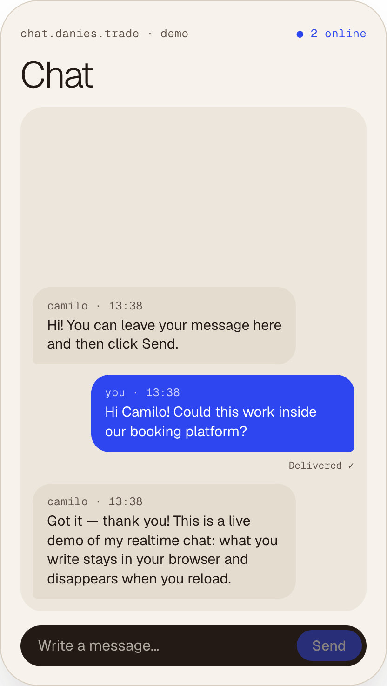
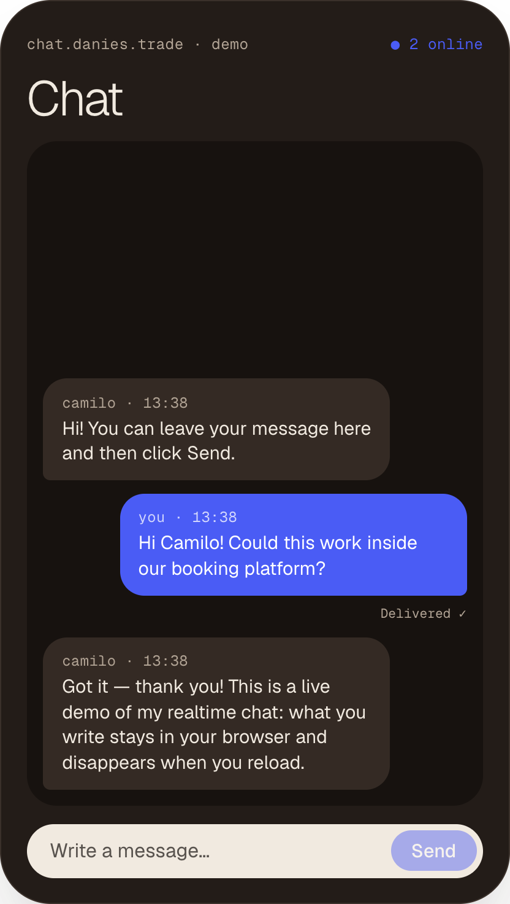
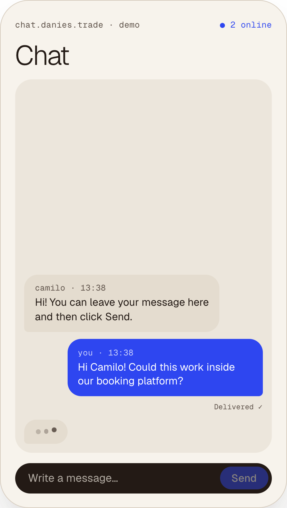
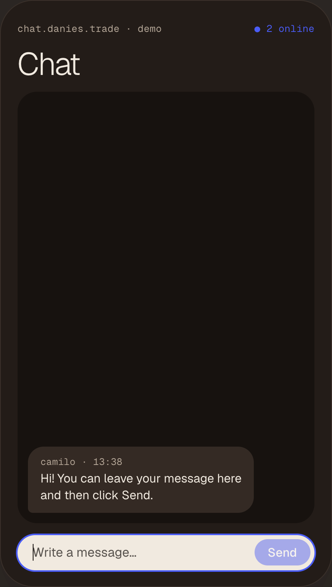

Diseñé y desarrollé el sistema completo — interfaz, mensajería en tiempo real, presencia, autenticación, control de acceso y despliegue.

 
*La misma conversación en modo claro y oscuro: tus mensajes a la derecha, los de los demás a la izquierda.*

## Pensado para vivir dentro de otros productos

El chat está pensado como un componente de comunicación flexible, no como una red social independiente.

Puede dar soporte a conversaciones entre compradores y vendedores, clientes y proveedores, miembros de una comunidad, colaboradores o cualquier otro participante dentro de un producto digital.

El contexto cambia. Las necesidades básicas siguen siendo las mismas: identidad, presencia, entrega instantánea y acceso controlado.

## Qué construí

### Mensajería en tiempo real
Los mensajes aparecen al instante, sin recargar.

### Presencia
Los participantes ven quién está conectado en ese momento.

### Acceso sin contraseña
Se entra con un código de un solo uso enviado por email.

### Seguridad en la base de datos
La autoría, las fechas y las reglas de acceso se aplican con Postgres RLS.

### Borrado automático
Los mensajes pueden caducar solos según lo que necesite cada producto.

 
*Pequeñas señales hacen que una conversación se sienta viva: un indicador de que alguien escribe, la confirmación de entrega y un primer mensaje que invita a escribir.*

## Pruébalo

La demo pública funciona entera en el navegador, así que no se guarda nada.

La implementación completa añade usuarios identificados, comunicación en tiempo real persistente, reglas de acceso en la base de datos y borrado automático de mensajes.

## Stack

### Front-end
React · Vite

### Back-end
Supabase · Postgres · Realtime

### Infraestructura
Hetzner · Caddy · Autoalojado
