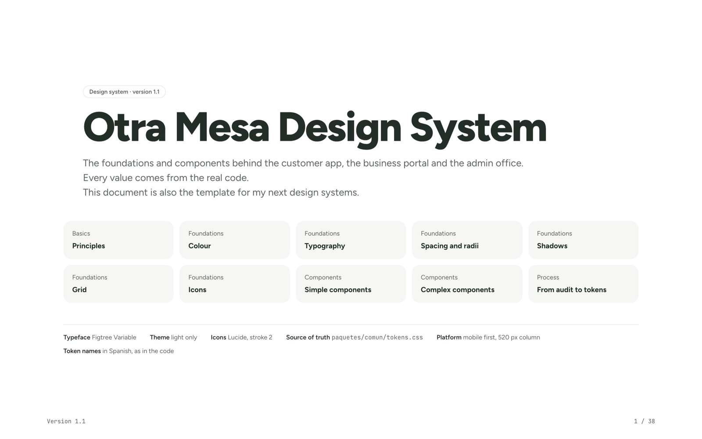
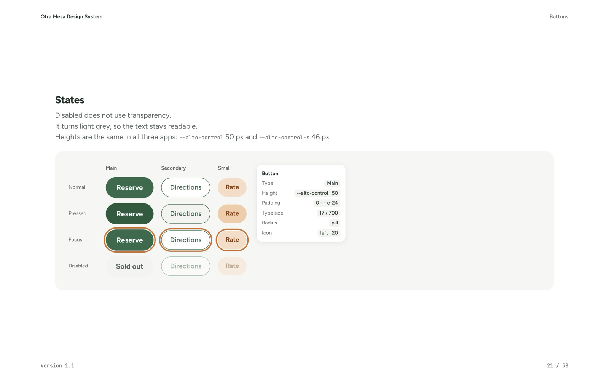

Diseñé la marca y el producto, y construí tres apps sobre una sola API: la app para clientes, un portal para los negocios y una oficina para la administración. Todo funciona de verdad — cuentas, reservas, códigos de recogida, valoraciones, avisos — menos el dinero: los pagos se simulan con tarjetas de prueba.

 
*Los restaurantes ofrecen la comida buena que no vendieron como "sorpresas de la casa", a un tercio del precio. Usted reserva una, paga y la recoge hoy mismo.*

## Menos desperdicio, una mesa más llena

Cada noche se tira comida buena por una sola razón: el día ha terminado. Otra Mesa le da una segunda mesa — a un tercio del precio para la gente que vive cerca, y con un retorno justo para el restaurante en lugar de una pérdida.

### Menos desperdicio
La comida que sigue siendo buena se come, no se tira.

### Una economía local más fuerte
Los restaurantes recuperan parte de sus costes y conocen a nuevos vecinos; la gente descubre lugares que nunca habría probado.

### Restaurantes que hacen el bien
Salvar comida es un gesto visible y generoso — una razón para participar que va más allá de los números.

Un producto que funciona, con restaurantes y mayoristas inventados en Barranquilla, Colombia.

## Una interfaz tranquila y limpia

La segunda versión es callada a propósito: fondo blanco, textos de un solo color, una sola tipografía, el verde del logo para los botones principales y el terracota solo en los detalles pequeños — estrellas, subrayados, etiquetas. Primero llegan las sorpresas destacadas, en tarjetas algo más grandes que se deslizan; debajo, filas más pequeñas: cerca de usted, para recoger ya, para la cena. En una sorpresa manda la foto y los detalles siguen en líneas cortas — y se ve cómo la valora la gente, estrella por estrella. Las horas se escriben como se dicen en Barranquilla: 5:15–5:45 p. m.

 
*Solo valora quien de verdad recogió su sorpresa. El mapa muestra todos los restaurantes — o solo los abiertos ahora, en hora de Barranquilla.*

## El sistema de diseño

Cada color, tamaño, esquina y sombra sale de un solo archivo de tokens que comparten las tres apps — nueve tamaños de letra, doce pasos de espacio, cinco radios, cuatro sombras. Lo documenté como un libro de especímenes de 38 páginas: principios, color con cada contraste comprobado, tipografía, espacio, sombras, rejilla, iconos y cada componente con sus estados. Es también la plantilla para mis próximos sistemas de diseño.

 
*La portada, y los botones con sus estados y los tokens que los sostienen. El documento está en inglés.*

[Ver el sistema de diseño (PDF en inglés, 38 páginas) ↗](/pdf/otra-mesa-design-system.pdf)

## Tres apps, una API

### Para los clientes
Descubrir y el mapa, reservar y pagar, un código QR para recoger, favoritos guardados en la cuenta, una valoración después de cada recogida y la cuenta de la comida que ha salvado.

### Para los negocios
Pedir el alta y ser aprobado; publicar las sorpresas del día o plantillas semanales que se publican solas (siempre con al menos un 30 % de descuento); escanear el QR del cliente con la cámara del móvil; invitar al equipo; ver el dinero; leer las opiniones — y recibir un aviso con cada reserva nueva.

### Para la administración
Un resumen con un gráfico de 14 días, solicitudes para aprobar o rechazar, restaurantes, reservas, pagos y liquidaciones, usuarios, reseñas y un registro de cada acción importante.

 
*El portal de negocios vive en el móvil del mostrador. Habla español: está hecho para los restaurantes de Barranquilla.*

 
*La oficina de la administración: lo que se salvó y se cobró, y cada reserva en cuanto llega.*

## Lo que construí

### La trastienda
Una API en Node.js delante de dos cocinas: Postgres como archivo oficial y MongoDB como brújula para "cerca de mí".

### Cerca de mí, al metro
Un índice 2dsphere y `$geoNear` encuentran lo que hay a 300 m, 1 km o 10 km — comprobado con la fórmula de Haversine.

### Reservas que nunca venden de más
El stock baja en un solo paso de la base de datos: si queda una sorpresa y dos personas pulsan a la vez, solo una la consigue.

### Pagos, simulados de principio a fin
Autorizado al reservar, cobrado al recoger, anulado si se cancela, reembolsable por la administración — con un 20 % de comisión y liquidaciones por restaurante. Solo se aceptan tarjetas de prueba, y solo se guardan los cuatro últimos dígitos.

### Entrar con Google o con un código por email
OpenID Connect con PKCE, o códigos de seis cifras hechos desde cero: solo se guardan huellas, los códigos caducan y se queman tras cinco intentos.

### Una cuenta, varias llaves
Una persona puede ser dueña de un restaurante y trabajar en otro. Las invitaciones por email se convierten en llaves al entrar por primera vez, y un restaurante nunca puede quedarse sin su último dueño.

### Avisos
Web Push con claves generadas en el servidor: una reserva nueva para el equipo, "su recogida empieza en 30 minutos" para el cliente, y un aviso cuando un favorito publica algo.

## Hecha para dar confianza

Copias de seguridad nocturnas probadas restaurándolas, cada cambio de la base de datos ensayado antes en una copia, límites de peticiones, borrado automático a los 30 días, dos vigilantes, una app que se instala y tiene pantalla sin conexión, y una política de privacidad que cubre cada flujo de datos (RGPD). Después de cada cambio, dos robots recorren todo el camino: 16 comprobaciones para clientes, 59 para negocios y administración.

## Stack

### Front-end
React · React Router · Vite · Leaflet + OpenStreetMap

### Back-end
Node.js · Express · Postgres · MongoDB · Web Push · Google OpenID Connect

### Infraestructura
Hetzner Alemania · Docker · Caddy · Monorepo
