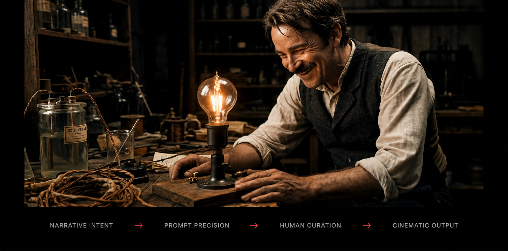

Del concepto y la estructura narrativa a la generación visual, la continuidad de escena y el montaje final, dirijo todo el proceso — uso la IA como herramienta de producción, mientras el storytelling, las decisiones visuales y el control editorial siguen siendo humanos.

### Rol
Dirección creativa · Storytelling · Producción con IA

### Contexto
Proyecto independiente · Creado y dirigido por mí

### Alcance
Narrativa · Visuales con IA · Motion · Montaje

<video controls playsinline preload="none" poster="/videos/ai-storytelling-poster.jpg">
  <source src="/videos/the-bridge.mp4" type="video/mp4">
</video>

> La IA aporta valor cuando la guían la continuidad narrativa, la disciplina visual y el control editorial humano.

