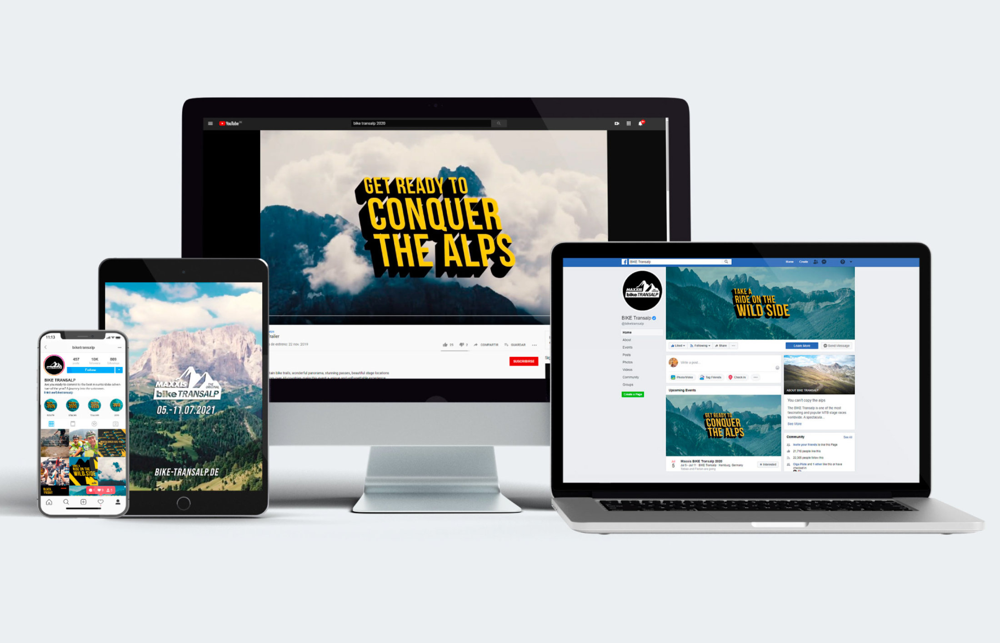
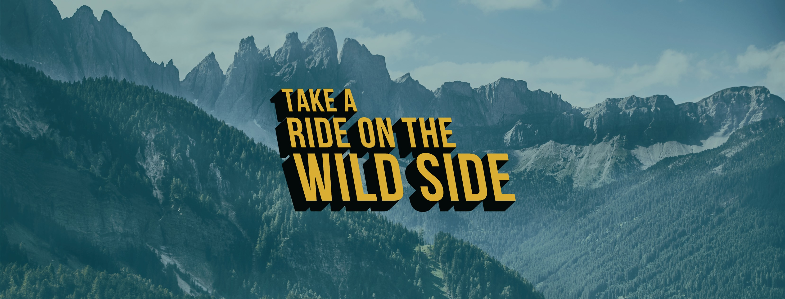
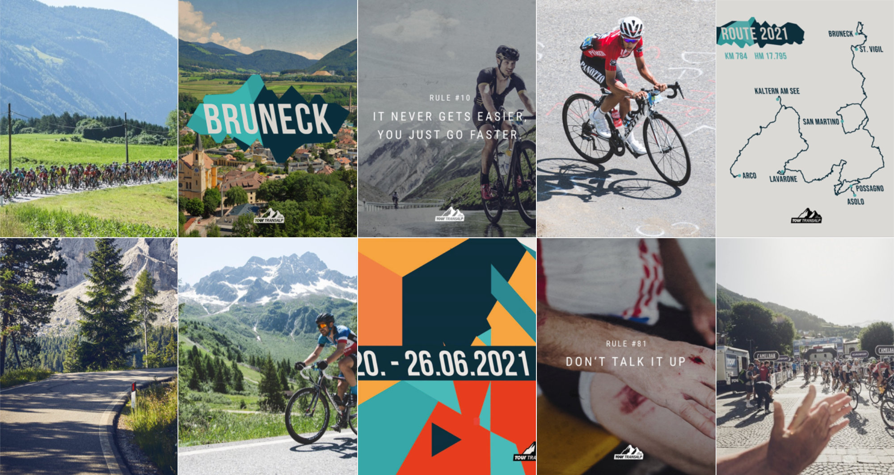

*Cross-platform promotional rollout developed for Bike Festival, Bike & Tour Transalp, including social media branding, teaser communication, web visuals and online audience touchpoints.*

*Animated campaign trailer created to generate anticipation and communicate the event's adventurous identity before launch. [Watch on YouTube ↗](https://www.youtube.com/watch?v=USL3U4n7VhQ)*

*Serial social media campaign developed to maintain audience engagement through countdown posts, route reveals, motivational content and participant-oriented storytelling.*
