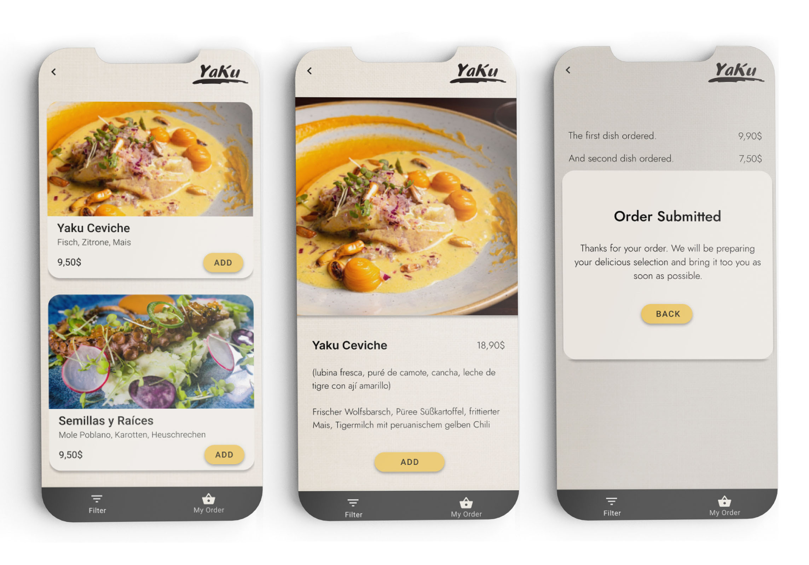
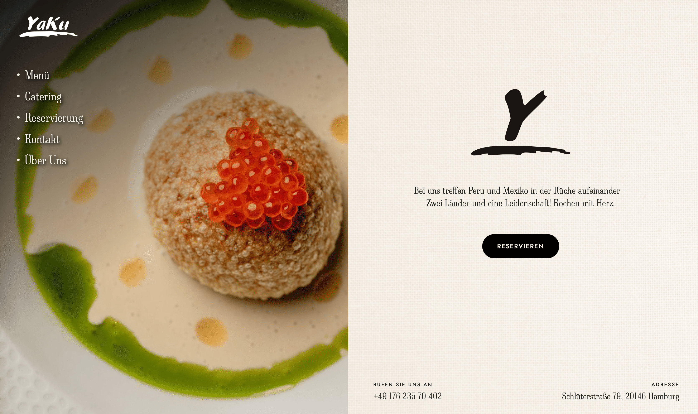
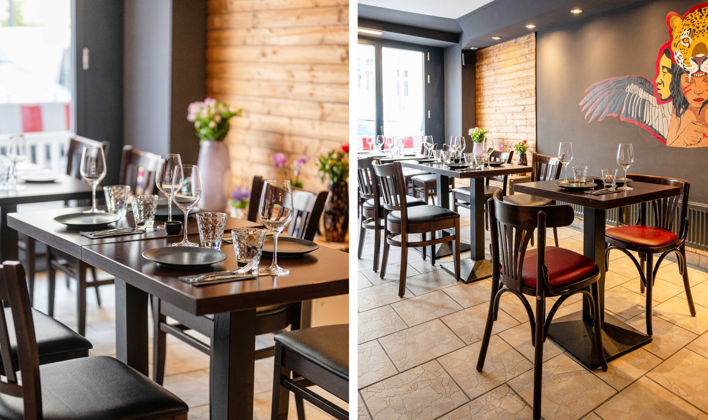

*Mobile ordering prototype.*

*Responsive digital presence developed to maintain visual consistency beyond the physical restaurant space.*

*Interior visuals and environmental branding created to strengthen the restaurant's physical character.*

## From prototype to product

In 2026 I turned the ordering prototype into a working app — guest ordering by QR code and a live kitchen screen. [See the case study: Yaku — Order from the Table →](/app-yaku.html)
