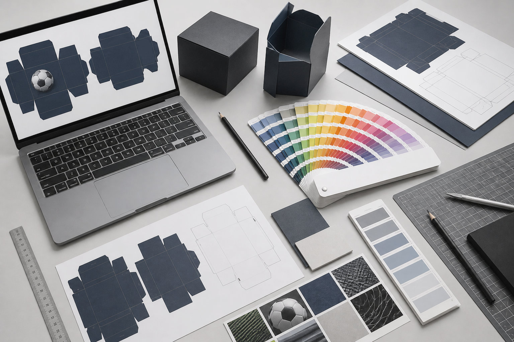

From concept and visual development to production-ready artwork, I worked across footballs, textiles and packaging, translating global brand guidelines into physical products made for retail.

### Role
Product Design · Art Direction · Packaging

### Context
Trade Con GmbH · Officially licensed products

### Scope
Footballs · Textiles · Retail Packaging

## The collection

  
  
  
  
  
  
  
  

*FIFA World Cup 26™, DFB and UEFA Champions League footballs — from the national team series to the club competition.*

*UCL_2025008 "We are the Champions" — 30-panel football, rendered in Cinema 4D. The same render spins in the hero of this site.*

## Packaging and retail

*Retail packaging for licensed and sports products — designed to work on the shelf, in the warehouse and in production.*

*From dielines to finished boxes: structural packaging, colour and print-ready artwork.*

---

Selected work created as part of my role at Trade Con GmbH and shown for portfolio purposes only. FIFA, UEFA and DFB names, trademarks, logos and licensed assets belong to their respective owners. Associated product and project rights remain with Trade Con GmbH and/or the respective rights holders.
