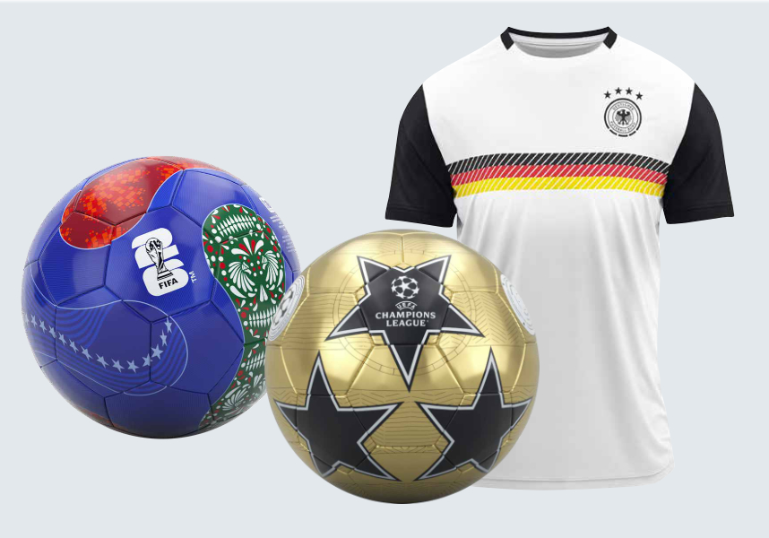
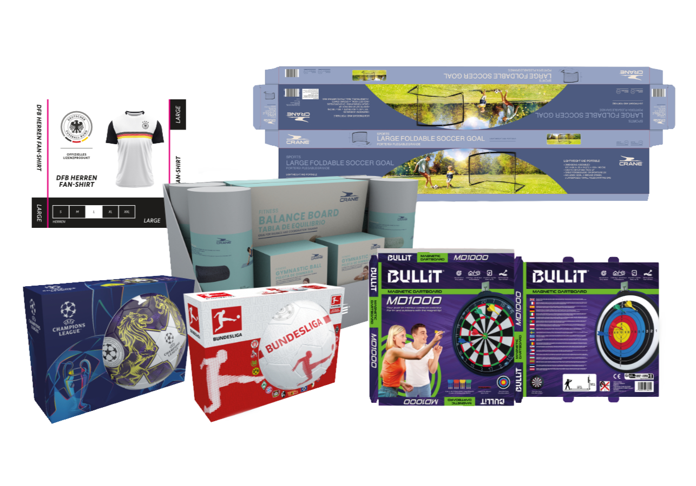

*UCL_2025008 "We are the Champions" — 30-panel football I designed at Trade Con (2025), rendered in Cinema 4D. The same render spins in the hero of this site.*

*50+ commercial SKUs developed across sports, fitness and retail sectors. Official licensed collections for FIFA, UEFA Champions League and DFB.*

*Developed during my role at Trade Con GmbH, Hamburg. Selected visuals displayed for portfolio presentation purposes.*

*Portfolio work created during my employment at Trade Con GmbH. All designs © Trade Con GmbH. UEFA, UEFA Champions League, FIFA, DFB and all related names, logos and marks are the property of their respective owners and are shown for portfolio presentation purposes only.*
